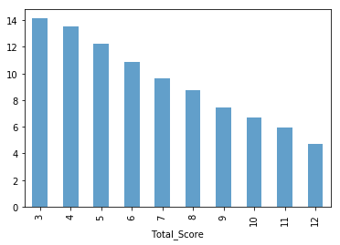

# RFM Analysis


```python
import time
import numpy as np
import pandas as pd
from base_model import *
import matplotlib.pyplot as plt
import warnings
warnings.filterwarnings('ignore')
%matplotlib inline
```


```python
dtypes = {
    'ORDERDATE': object,
    'ORDERID': object, 
    'AMOUNTINFO': np.float32, 
} # 设置每列数据类型
data = pd.read_csv('sales.csv', index_col='USERID', dtype=dtypes)
```


```python
data.head(5) # 简单看看数据
```


<div>
<style scoped>
    .dataframe tbody tr th:only-of-type {
        vertical-align: middle;
    }

    .dataframe tbody tr th {
        vertical-align: top;
    }

    .dataframe thead th {
        text-align: right;
    }
</style>
<table border="1" class="dataframe">
  <thead>
    <tr style="text-align: right;">
      <th></th>
      <th>ORDERDATE</th>
      <th>ORDERID</th>
      <th>AMOUNTINFO</th>
    </tr>
    <tr>
      <th>USERID</th>
      <th></th>
      <th></th>
      <th></th>
    </tr>
  </thead>
  <tbody>
    <tr>
      <th>142074</th>
      <td>2016-01-01</td>
      <td>4196439032</td>
      <td>9399.0</td>
    </tr>
    <tr>
      <th>56927</th>
      <td>2016-01-01</td>
      <td>4198324983</td>
      <td>8799.0</td>
    </tr>
    <tr>
      <th>87058</th>
      <td>2016-01-01</td>
      <td>4191287379</td>
      <td>6899.0</td>
    </tr>
    <tr>
      <th>136104</th>
      <td>2016-01-01</td>
      <td>4198508313</td>
      <td>5999.0</td>
    </tr>
    <tr>
      <th>117831</th>
      <td>2016-01-01</td>
      <td>4202238313</td>
      <td>5399.0</td>
    </tr>
  </tbody>
</table>
</div>


```python
data.describe() # 数据的简单描述统计
```


<div>
<style scoped>
    .dataframe tbody tr th:only-of-type {
        vertical-align: middle;
    }

    .dataframe tbody tr th {
        vertical-align: top;
    }

    .dataframe thead th {
        text-align: right;
    }
</style>
<table border="1" class="dataframe">
  <thead>
    <tr style="text-align: right;">
      <th></th>
      <th>AMOUNTINFO</th>
    </tr>
  </thead>
  <tbody>
    <tr>
      <th>count</th>
      <td>86127.000000</td>
    </tr>
    <tr>
      <th>mean</th>
      <td>744.705261</td>
    </tr>
    <tr>
      <th>std</th>
      <td>1425.211182</td>
    </tr>
    <tr>
      <th>min</th>
      <td>0.500000</td>
    </tr>
    <tr>
      <th>25%</th>
      <td>13.000000</td>
    </tr>
    <tr>
      <th>50%</th>
      <td>59.000000</td>
    </tr>
    <tr>
      <th>75%</th>
      <td>629.000000</td>
    </tr>
    <tr>
      <th>max</th>
      <td>30999.000000</td>
    </tr>
  </tbody>
</table>
</div>


#### 1、异常值处理


```python
data.isnull().any(axis=0) # 查看有缺失值的列
```


    ORDERDATE      True
    ORDERID       False
    AMOUNTINFO     True
    dtype: bool


```python
data.isnull().any(axis=1).sum() # 统计有缺失值的记录（行）个数
```


    10


```python
data[data.isnull().any(axis=1)] # 展示缺失数据的记录
```


<div>
<style scoped>
    .dataframe tbody tr th:only-of-type {
        vertical-align: middle;
    }

    .dataframe tbody tr th {
        vertical-align: top;
    }

    .dataframe thead th {
        text-align: right;
    }
</style>
<table border="1" class="dataframe">
  <thead>
    <tr style="text-align: right;">
      <th></th>
      <th>ORDERDATE</th>
      <th>ORDERID</th>
      <th>AMOUNTINFO</th>
    </tr>
    <tr>
      <th>USERID</th>
      <th></th>
      <th></th>
      <th></th>
    </tr>
  </thead>
  <tbody>
    <tr>
      <th>75849</th>
      <td>2016-01-01</td>
      <td>4197103430</td>
      <td>NaN</td>
    </tr>
    <tr>
      <th>103714</th>
      <td>NaN</td>
      <td>4136159682</td>
      <td>189.0</td>
    </tr>
    <tr>
      <th>155209</th>
      <td>2016-01-01</td>
      <td>4177940815</td>
      <td>NaN</td>
    </tr>
    <tr>
      <th>139877</th>
      <td>NaN</td>
      <td>4111956196</td>
      <td>6.3</td>
    </tr>
    <tr>
      <th>54599</th>
      <td>2016-01-01</td>
      <td>4119525205</td>
      <td>NaN</td>
    </tr>
    <tr>
      <th>65456</th>
      <td>2016-01-02</td>
      <td>4195643356</td>
      <td>NaN</td>
    </tr>
    <tr>
      <th>122134</th>
      <td>2016-09-21</td>
      <td>3826649773</td>
      <td>NaN</td>
    </tr>
    <tr>
      <th>116995</th>
      <td>2016-10-24</td>
      <td>3981569421</td>
      <td>NaN</td>
    </tr>
    <tr>
      <th>98888</th>
      <td>2016-12-06</td>
      <td>3814398698</td>
      <td>NaN</td>
    </tr>
    <tr>
      <th>145951</th>
      <td>2016-12-29</td>
      <td>4139830098</td>
      <td>NaN</td>
    </tr>
  </tbody>
</table>
</div>


```python
data_tra = data.dropna() # 去掉缺失值数据
```


```python
data_tra.describe()
```


<div>
<style scoped>
    .dataframe tbody tr th:only-of-type {
        vertical-align: middle;
    }

    .dataframe tbody tr th {
        vertical-align: top;
    }

    .dataframe thead th {
        text-align: right;
    }
</style>
<table border="1" class="dataframe">
  <thead>
    <tr style="text-align: right;">
      <th></th>
      <th>AMOUNTINFO</th>
    </tr>
  </thead>
  <tbody>
    <tr>
      <th>count</th>
      <td>86125.000000</td>
    </tr>
    <tr>
      <th>mean</th>
      <td>744.720276</td>
    </tr>
    <tr>
      <th>std</th>
      <td>1425.224243</td>
    </tr>
    <tr>
      <th>min</th>
      <td>0.500000</td>
    </tr>
    <tr>
      <th>25%</th>
      <td>13.000000</td>
    </tr>
    <tr>
      <th>50%</th>
      <td>59.000000</td>
    </tr>
    <tr>
      <th>75%</th>
      <td>629.000000</td>
    </tr>
    <tr>
      <th>max</th>
      <td>30999.000000</td>
    </tr>
  </tbody>
</table>
</div>


#### 2、日期格式转换


```python
data_tra['ORDERDATE'] = pd.to_datetime(data_tra['ORDERDATE'], format='%Y-%m-%d')
data_tra.dtypes
```


    ORDERDATE     datetime64[ns]
    ORDERID               object
    AMOUNTINFO           float32
    dtype: object


```python
print data_tra['ORDERDATE'].max()
print data_tra['ORDERDATE'].min()
```

    2016-12-29 00:00:00
    2016-01-01 00:00:00


#### 3、数据转换


```python
# 计算原始最近一次的订单
recency = data_tra['ORDERDATE'].groupby(data_tra.index).max()
```


```python
# 计算原始订单频率
frequency = data_tra['ORDERDATE'].groupby(data_tra.index).count()
```


```python
# 计算原始订单总金额
monetary = data_tra['AMOUNTINFO'].groupby(data_tra.index).sum()
```

#### 4、计算RFM得分


```python
# R得分
deadline = pd.datetime(2017,01,01)
r_interval = (deadline - recency).dt.days # 计算R间距
r_score = pd.cut(r_interval, 5 ,labels=[5,4,3,2,1])
```


```python
# F得分
f_score = pd.cut(frequency, 5, labels=[1,2,3,4,5])
```


```python
# M得分
m_score = pd.cut(monetary, 5, labels=[1,2,3,4,5])
```


```python
rfm_list = [r_score, f_score, m_score]
rfm_cols = ['r_score', 'f_score', 'm_score']
rfm_df = pd.DataFrame(np.array(rfm_list).transpose(),
                     dtype=np.int32,
                     columns=rfm_cols,
                     index=frequency.index)
```


```python
rfm_df.head(5)
```


<div>
<style scoped>
    .dataframe tbody tr th:only-of-type {
        vertical-align: middle;
    }

    .dataframe tbody tr th {
        vertical-align: top;
    }

    .dataframe thead th {
        text-align: right;
    }
</style>
<table border="1" class="dataframe">
  <thead>
    <tr style="text-align: right;">
      <th></th>
      <th>r_score</th>
      <th>f_score</th>
      <th>m_score</th>
    </tr>
    <tr>
      <th>USERID</th>
      <th></th>
      <th></th>
      <th></th>
    </tr>
  </thead>
  <tbody>
    <tr>
      <th>51220</th>
      <td>4</td>
      <td>1</td>
      <td>1</td>
    </tr>
    <tr>
      <th>51221</th>
      <td>2</td>
      <td>1</td>
      <td>1</td>
    </tr>
    <tr>
      <th>51224</th>
      <td>3</td>
      <td>1</td>
      <td>1</td>
    </tr>
    <tr>
      <th>51225</th>
      <td>4</td>
      <td>1</td>
      <td>1</td>
    </tr>
    <tr>
      <th>51226</th>
      <td>1</td>
      <td>1</td>
      <td>1</td>
    </tr>
  </tbody>
</table>
</div>


#### 5、计算RFM总得分


```python
# 加权得分
rfm_df['rfm_wscore'] = rfm_df['r_score']*0.6 + rfm_df['f_score']*0.3 + rfm_df['m_score']*0.1
rfm_df.head(4)
```


<div>
<style scoped>
    .dataframe tbody tr th:only-of-type {
        vertical-align: middle;
    }

    .dataframe tbody tr th {
        vertical-align: top;
    }

    .dataframe thead th {
        text-align: right;
    }
</style>
<table border="1" class="dataframe">
  <thead>
    <tr style="text-align: right;">
      <th></th>
      <th>r_score</th>
      <th>f_score</th>
      <th>m_score</th>
      <th>rfm_wscore</th>
    </tr>
    <tr>
      <th>USERID</th>
      <th></th>
      <th></th>
      <th></th>
      <th></th>
    </tr>
  </thead>
  <tbody>
    <tr>
      <th>51220</th>
      <td>4</td>
      <td>1</td>
      <td>1</td>
      <td>2.8</td>
    </tr>
    <tr>
      <th>51221</th>
      <td>2</td>
      <td>1</td>
      <td>1</td>
      <td>1.6</td>
    </tr>
    <tr>
      <th>51224</th>
      <td>3</td>
      <td>1</td>
      <td>1</td>
      <td>2.2</td>
    </tr>
    <tr>
      <th>51225</th>
      <td>4</td>
      <td>1</td>
      <td>1</td>
      <td>2.8</td>
    </tr>
  </tbody>
</table>
</div>


```python
# RFM组合
# rfm_df_tmp = rfm_df.copy()
# rfm_df_tmp['r_score'] = rfm_df_tmp['r_score'].astype('string')
# rfm_df_tmp['f_score'] = rfm_df_tmp['f_score'].astype('string')
# rfm_df_tmp['m_score'] = rfm_df_tmp['m_score'].astype('string')
# rfm_df['rfm_comb'] = rfm_df_tmp['r_score'].str.cat(rfm_df_tmp['f_score']).str.cat(rfm_df_tmp['m_score'])
rfm_df['rfm_comb'] = rfm_df.r_score.map(str) + rfm_df.f_score.map(str) + rfm_df.m_score.map(str)
rfm_df.head(5)
```


<div>
<style scoped>
    .dataframe tbody tr th:only-of-type {
        vertical-align: middle;
    }

    .dataframe tbody tr th {
        vertical-align: top;
    }

    .dataframe thead th {
        text-align: right;
    }
</style>
<table border="1" class="dataframe">
  <thead>
    <tr style="text-align: right;">
      <th></th>
      <th>r_score</th>
      <th>f_score</th>
      <th>m_score</th>
      <th>rfm_wscore</th>
      <th>rfm_comb</th>
    </tr>
    <tr>
      <th>USERID</th>
      <th></th>
      <th></th>
      <th></th>
      <th></th>
      <th></th>
    </tr>
  </thead>
  <tbody>
    <tr>
      <th>51220</th>
      <td>4</td>
      <td>1</td>
      <td>1</td>
      <td>2.8</td>
      <td>411</td>
    </tr>
    <tr>
      <th>51221</th>
      <td>2</td>
      <td>1</td>
      <td>1</td>
      <td>1.6</td>
      <td>211</td>
    </tr>
    <tr>
      <th>51224</th>
      <td>3</td>
      <td>1</td>
      <td>1</td>
      <td>2.2</td>
      <td>311</td>
    </tr>
    <tr>
      <th>51225</th>
      <td>4</td>
      <td>1</td>
      <td>1</td>
      <td>2.8</td>
      <td>411</td>
    </tr>
    <tr>
      <th>51226</th>
      <td>1</td>
      <td>1</td>
      <td>1</td>
      <td>1.0</td>
      <td>111</td>
    </tr>
  </tbody>
</table>
</div>


```python
rfm_df.describe()
```


<div>
<style scoped>
    .dataframe tbody tr th:only-of-type {
        vertical-align: middle;
    }

    .dataframe tbody tr th {
        vertical-align: top;
    }

    .dataframe thead th {
        text-align: right;
    }
</style>
<table border="1" class="dataframe">
  <thead>
    <tr style="text-align: right;">
      <th></th>
      <th>r_score</th>
      <th>f_score</th>
      <th>m_score</th>
      <th>rfm_wscore</th>
    </tr>
  </thead>
  <tbody>
    <tr>
      <th>count</th>
      <td>60496.000000</td>
      <td>60496.000000</td>
      <td>60496.000000</td>
      <td>60496.000000</td>
    </tr>
    <tr>
      <th>mean</th>
      <td>3.306665</td>
      <td>1.014348</td>
      <td>1.000132</td>
      <td>2.388317</td>
    </tr>
    <tr>
      <th>std</th>
      <td>1.401301</td>
      <td>0.119753</td>
      <td>0.018182</td>
      <td>0.845130</td>
    </tr>
    <tr>
      <th>min</th>
      <td>1.000000</td>
      <td>1.000000</td>
      <td>1.000000</td>
      <td>1.000000</td>
    </tr>
    <tr>
      <th>25%</th>
      <td>2.000000</td>
      <td>1.000000</td>
      <td>1.000000</td>
      <td>1.600000</td>
    </tr>
    <tr>
      <th>50%</th>
      <td>3.000000</td>
      <td>1.000000</td>
      <td>1.000000</td>
      <td>2.500000</td>
    </tr>
    <tr>
      <th>75%</th>
      <td>5.000000</td>
      <td>1.000000</td>
      <td>1.000000</td>
      <td>3.400000</td>
    </tr>
    <tr>
      <th>max</th>
      <td>5.000000</td>
      <td>5.000000</td>
      <td>5.000000</td>
      <td>5.000000</td>
    </tr>
  </tbody>
</table>
</div>


```python
for column in rfm_df.columns.tolist():
    tmp = pd.DataFrame(columns=[column, '%s count'%column])
    for i in sorted(rfm_df[column].unique().tolist()):
        cnt = rfm_df[rfm_df[column]==i][column].count()
        tmp = tmp.append({
            column:i,
            '%s count'%column:cnt,
        }, ignore_index=True)
    tmp.index = tmp[column]; del tmp[column]
    tmp.plot.bar(title='%s & count present'%column.upper(), alpha=0.7)
    print tmp
```

            r_score count
    r_score              
    1                8824
    2               10239
    3               11247
    4               13933
    5               16253
            f_score count
    f_score              
    1               59631
    2                 864
    5                   1
            m_score count
    m_score              
    1               60491
    2                   4
    5                   1
                rfm_wscore count
    rfm_wscore                  
    1.0                   8822.0
    1.3                      2.0
    1.6                  10224.0
    1.7                      1.0
    1.9                     14.0
    2.2                  11163.0
    2.5                     83.0
    2.6                      1.0
    2.8                  13689.0
    2.9                      2.0
    3.1                    242.0
    3.4                  15730.0
    3.7                    522.0
    5.0                      1.0
             rfm_comb count
    rfm_comb               
    111                8822
    121                   2
    211               10224
    212                   1
    221                  14
    311               11163
    321                  83
    322                   1
    411               13689
    412                   2
    421                 242
    511               15730
    521                 522
    555                   1


```python
rfm_df.loc[74270]
# 客户消费状态不乐观，主要体现在消费频率，消费金额，其主要原因是有一个用户消费额高，消费频率也高，导致区间向大值区域偏移
```


    r_score         5
    f_score         5
    m_score         5
    rfm_wscore      5
    rfm_comb      555
    Name: 74270, dtype: object


#### 小插曲 pandas.cat


```python
# cat(self, others=None, sep=None, na_rep=None)
'''
:param other: 要合并的另一个对象，如果为空则合并左侧的组合
:param sep: 合并的分隔符，默认为空
:param na_rep: 如果遇到NA缺失值时如何处理，默认忽略
'''
print '{:-^60}'.format('示例一')
print pd.Series(['a','b','c']).str.cat(sep='--')
print '{:-^60}'.format('示例二')
print pd.Series(['a','b','c']).str.cat(['A','B','C'], sep='!=')
# 更多信息可以help(pd.Series.cat)
```

    -------------------------示例一--------------------------
    a--b--c
    -------------------------示例二--------------------------
    0    a!=A
    1    b!=B
    2    c!=C
    dtype: object


#### 6、写入数据库


```python
# 数据库设置
table_name = 'sales_rfm_score'
config = {
    "host" : "localhost",
    "port" : 3306,
    "username" : "root",
    "password" : "root",
    "dbname" : "work",
    "charset" : "utf8",
}
table_define = {
    'table_name' : table_name,
    'table_primary_key' : [],
    'table_indexs' : [],
    'table_uniques' : [],
    'table_options': [],
    'table_fields' : [
        ('`userid`', 'VARCHAR(20)', 'NOT NULL'),
        ('`r_score`', 'int(2)', 'NOT NULL'),
        ('`f_score`', 'int(2)', 'NOT NULL'),
        ('`m_score`', 'int(2)', 'NOT NULL'),
        ('`rfm_wscore`', 'DECIMAL(10,2)'),
        ('`rfm_comb`', 'VARCHAR(10)'),
    ],
}
```


```python
sql = BaseModel.gen_create_table_sql(table_define)
model = BaseModel(config)
model._query_table(sql)
```

    INFO [2019-02-21 20:57:58,871][base_model.py:54][4461:MainThread] excute sql done[runtime: 0, args: ('SET autocommit=1;',), kwargs: {}, host_info: 127.0.0.1 via TCP/IP]
    INFO [2019-02-21 20:57:58,887][base_model.py:54][4461:MainThread] excute sql done[runtime: 0, args: ('CREATE TABLE IF NOT EXISTS `sales_rfm_score` (\n `userid` VARCHAR(20) NOT NULL,\n `r_score` int(2) NOT NULL,\n `f_score` int(2) NOT NULL,\n `m_score` int(2) NOT NULL,\n `rfm_wscore` DECIMAL(10,2),\n `rfm_comb` VARCHAR(10),\n `insert_time` int(10) NOT NULL DEFAULT 0,\n `update_time` int(10) NOT NULL DEFAULT 0\n) ENGINE=InnoDB DEFAULT CHARSET=utf8 \n ;',), kwargs: {}, host_info: 127.0.0.1 via TCP/IP]


    0L


```python
insert_param, key_list = [],[]
for index, row in rfm_df.iterrows():
    row = row.to_dict()
    row['userid'] = index
    row['insert_time'] = int(time.time())
    insert_param.append(row.values())
    if not key_list: key_list = row.keys()
    if len(insert_param) >= 10000:
        model._insert_table_many(table_name, key_list, insert_param)
        insert_param = []
model._insert_table_many(table_name, key_list, insert_param)
```

    INFO [2019-02-21 20:58:01,102][base_model.py:289][4461:MainThread] insert many finish[sql: INSERT INTO `sales_rfm_score` (`m_score`,`userid`,`f_score`,`rfm_comb`,`rfm_wscore`,`insert_time`,`r_score`) VALUES(%s,%s,%s,%s,%s,%s,%s) ON DUPLICATE KEY UPDATE `update_time`=1550753880;, row: 10000]
    INFO [2019-02-21 20:58:02,755][base_model.py:289][4461:MainThread] insert many finish[sql: INSERT INTO `sales_rfm_score` (`m_score`,`userid`,`f_score`,`rfm_comb`,`rfm_wscore`,`insert_time`,`r_score`) VALUES(%s,%s,%s,%s,%s,%s,%s) ON DUPLICATE KEY UPDATE `update_time`=1550753882;, row: 10000]
    INFO [2019-02-21 20:58:04,390][base_model.py:289][4461:MainThread] insert many finish[sql: INSERT INTO `sales_rfm_score` (`m_score`,`userid`,`f_score`,`rfm_comb`,`rfm_wscore`,`insert_time`,`r_score`) VALUES(%s,%s,%s,%s,%s,%s,%s) ON DUPLICATE KEY UPDATE `update_time`=1550753884;, row: 10000]
    INFO [2019-02-21 20:58:06,005][base_model.py:289][4461:MainThread] insert many finish[sql: INSERT INTO `sales_rfm_score` (`m_score`,`userid`,`f_score`,`rfm_comb`,`rfm_wscore`,`insert_time`,`r_score`) VALUES(%s,%s,%s,%s,%s,%s,%s) ON DUPLICATE KEY UPDATE `update_time`=1550753885;, row: 10000]
    INFO [2019-02-21 20:58:07,612][base_model.py:289][4461:MainThread] insert many finish[sql: INSERT INTO `sales_rfm_score` (`m_score`,`userid`,`f_score`,`rfm_comb`,`rfm_wscore`,`insert_time`,`r_score`) VALUES(%s,%s,%s,%s,%s,%s,%s) ON DUPLICATE KEY UPDATE `update_time`=1550753887;, row: 10000]
    INFO [2019-02-21 20:58:09,338][base_model.py:289][4461:MainThread] insert many finish[sql: INSERT INTO `sales_rfm_score` (`m_score`,`userid`,`f_score`,`rfm_comb`,`rfm_wscore`,`insert_time`,`r_score`) VALUES(%s,%s,%s,%s,%s,%s,%s) ON DUPLICATE KEY UPDATE `update_time`=1550753889;, row: 10000]
    INFO [2019-02-21 20:58:09,426][base_model.py:289][4461:MainThread] insert many finish[sql: INSERT INTO `sales_rfm_score` (`m_score`,`userid`,`f_score`,`rfm_comb`,`rfm_wscore`,`insert_time`,`r_score`) VALUES(%s,%s,%s,%s,%s,%s,%s) ON DUPLICATE KEY UPDATE `update_time`=1550753889;, row: 496]


### [实战 Retail Transaction Data From Kaggle](https://www.kaggle.com/regivm/retailtransactiondata/). 

Context
----
The data provides customer and date level transactions for few years. It can be used for demonstration of any analysis that require transaction information like RFM. The data also provide response information of customers to a promotion campaign.

Highlight of this dataset is that you can evaluate the effectiveness RFM group by checking the one of the business metric; the response of customers.

Content
---
Transaction data provides customer_id, transaction date and Amount of purchase. Response data provides the response information of each of the customers. It is a binary variable indicating whether the customer responded to a campaign or not.

Acknowledgements
---
Extremely thankful numerous kernel and data publishers of Kaggle and Github. Learnt a lot from these communities.

Inspiration
---
More innovative approaches for handling RFM Analysis.


```python
import time
import numpy as np
import pandas as pd
from base_model import *
import matplotlib.pyplot as plt
import warnings
warnings.filterwarnings('ignore')
%matplotlib inline
```


```python
data = pd.read_csv('Retail_Data_Transactions.csv', parse_dates=['trans_date'])
data.head(5)
```


<div>
<style scoped>
    .dataframe tbody tr th:only-of-type {
        vertical-align: middle;
    }

    .dataframe tbody tr th {
        vertical-align: top;
    }

    .dataframe thead th {
        text-align: right;
    }
</style>
<table border="1" class="dataframe">
  <thead>
    <tr style="text-align: right;">
      <th></th>
      <th>customer_id</th>
      <th>trans_date</th>
      <th>tran_amount</th>
    </tr>
  </thead>
  <tbody>
    <tr>
      <th>0</th>
      <td>CS5295</td>
      <td>2013-02-11</td>
      <td>35</td>
    </tr>
    <tr>
      <th>1</th>
      <td>CS4768</td>
      <td>2015-03-15</td>
      <td>39</td>
    </tr>
    <tr>
      <th>2</th>
      <td>CS2122</td>
      <td>2013-02-26</td>
      <td>52</td>
    </tr>
    <tr>
      <th>3</th>
      <td>CS1217</td>
      <td>2011-11-16</td>
      <td>99</td>
    </tr>
    <tr>
      <th>4</th>
      <td>CS1850</td>
      <td>2013-11-20</td>
      <td>78</td>
    </tr>
  </tbody>
</table>
</div>


```python
data.info()
```

    <class 'pandas.core.frame.DataFrame'>
    RangeIndex: 125000 entries, 0 to 124999
    Data columns (total 3 columns):
    customer_id    125000 non-null object
    trans_date     125000 non-null datetime64[ns]
    tran_amount    125000 non-null int64
    dtypes: datetime64[ns](1), int64(1), object(1)
    memory usage: 2.9+ MB


```python
data.describe()
```


<div>
<style scoped>
    .dataframe tbody tr th:only-of-type {
        vertical-align: middle;
    }

    .dataframe tbody tr th {
        vertical-align: top;
    }

    .dataframe thead th {
        text-align: right;
    }
</style>
<table border="1" class="dataframe">
  <thead>
    <tr style="text-align: right;">
      <th></th>
      <th>tran_amount</th>
    </tr>
  </thead>
  <tbody>
    <tr>
      <th>count</th>
      <td>125000.000000</td>
    </tr>
    <tr>
      <th>mean</th>
      <td>64.991912</td>
    </tr>
    <tr>
      <th>std</th>
      <td>22.860006</td>
    </tr>
    <tr>
      <th>min</th>
      <td>10.000000</td>
    </tr>
    <tr>
      <th>25%</th>
      <td>47.000000</td>
    </tr>
    <tr>
      <th>50%</th>
      <td>65.000000</td>
    </tr>
    <tr>
      <th>75%</th>
      <td>83.000000</td>
    </tr>
    <tr>
      <th>max</th>
      <td>105.000000</td>
    </tr>
  </tbody>
</table>
</div>


```python
data.isnull().any(axis=0)
```


    customer_id    False
    trans_date     False
    tran_amount    False
    dtype: bool


```python
data.isnull().any(axis=1).sum()
# 无缺失值
```


    0


```python
deadline = pd.datetime(2015,4,1)
data['time_interval'] = deadline - data['trans_date']
data['time_interval'].astype('timedelta64[D]')
data['time_interval'] = data['time_interval'] / np.timedelta64(1, 'D')
data.head()
```


<div>
<style scoped>
    .dataframe tbody tr th:only-of-type {
        vertical-align: middle;
    }

    .dataframe tbody tr th {
        vertical-align: top;
    }

    .dataframe thead th {
        text-align: right;
    }
</style>
<table border="1" class="dataframe">
  <thead>
    <tr style="text-align: right;">
      <th></th>
      <th>customer_id</th>
      <th>trans_date</th>
      <th>tran_amount</th>
      <th>time_interval</th>
    </tr>
  </thead>
  <tbody>
    <tr>
      <th>0</th>
      <td>CS5295</td>
      <td>2013-02-11</td>
      <td>35</td>
      <td>779.0</td>
    </tr>
    <tr>
      <th>1</th>
      <td>CS4768</td>
      <td>2015-03-15</td>
      <td>39</td>
      <td>17.0</td>
    </tr>
    <tr>
      <th>2</th>
      <td>CS2122</td>
      <td>2013-02-26</td>
      <td>52</td>
      <td>764.0</td>
    </tr>
    <tr>
      <th>3</th>
      <td>CS1217</td>
      <td>2011-11-16</td>
      <td>99</td>
      <td>1232.0</td>
    </tr>
    <tr>
      <th>4</th>
      <td>CS1850</td>
      <td>2013-11-20</td>
      <td>78</td>
      <td>497.0</td>
    </tr>
  </tbody>
</table>
</div>


```python
# 只取最近两年的数据分析
data = data[data['time_interval']<365*2]
data.shape
```


    (63633, 4)


```python
rfm_df = data.groupby('customer_id')\
    .agg({
        'time_interval': lambda x:x.min(),# Recency
        'customer_id': lambda x: len(x),# Frequency
        'tran_amount': lambda x: x.sum()# Monetary Value
    })          
rfm_df.rename(columns={
                'time_interval': 'recency', 
                'customer_id': 'frequency', 
                'tran_amount': 'monetary_value'},inplace=True)
```


```python
cols = rfm_df.columns.to_list()
rfm_df.head(4)
```


<div>
<style scoped>
    .dataframe tbody tr th:only-of-type {
        vertical-align: middle;
    }

    .dataframe tbody tr th {
        vertical-align: top;
    }

    .dataframe thead th {
        text-align: right;
    }
</style>
<table border="1" class="dataframe">
  <thead>
    <tr style="text-align: right;">
      <th></th>
      <th>recency</th>
      <th>frequency</th>
      <th>monetary_value</th>
    </tr>
    <tr>
      <th>customer_id</th>
      <th></th>
      <th></th>
      <th></th>
    </tr>
  </thead>
  <tbody>
    <tr>
      <th>CS1112</th>
      <td>77.0</td>
      <td>6</td>
      <td>358</td>
    </tr>
    <tr>
      <th>CS1113</th>
      <td>51.0</td>
      <td>11</td>
      <td>775</td>
    </tr>
    <tr>
      <th>CS1114</th>
      <td>48.0</td>
      <td>11</td>
      <td>804</td>
    </tr>
    <tr>
      <th>CS1115</th>
      <td>27.0</td>
      <td>10</td>
      <td>765</td>
    </tr>
  </tbody>
</table>
</div>


```python
# 基于四分位数进行切分
quartiles = rfm_df.quantile(q=[0.25,0.50,0.75]).to_dict()
for col in cols:
    bins = [0, quartiles[col][0.25], quartiles[col][0.50], quartiles[col][0.75], float('inf')]
    label = [1,2,3,4] if col=='recency' else [4,3,2,1]
    rfm_df['%s_score'%col] = pd.cut(rfm_df[col], bins, labels=label)
    rfm_df['%s_score'%col] = rfm_df['%s_score'%col].astype('int32')
rfm_df.head(4)
```


<div>
<style scoped>
    .dataframe tbody tr th:only-of-type {
        vertical-align: middle;
    }

    .dataframe tbody tr th {
        vertical-align: top;
    }

    .dataframe thead th {
        text-align: right;
    }
</style>
<table border="1" class="dataframe">
  <thead>
    <tr style="text-align: right;">
      <th></th>
      <th>recency</th>
      <th>frequency</th>
      <th>monetary_value</th>
      <th>recency_score</th>
      <th>frequency_score</th>
      <th>monetary_value_score</th>
    </tr>
    <tr>
      <th>customer_id</th>
      <th></th>
      <th></th>
      <th></th>
      <th></th>
      <th></th>
      <th></th>
    </tr>
  </thead>
  <tbody>
    <tr>
      <th>CS1112</th>
      <td>77.0</td>
      <td>6</td>
      <td>358</td>
      <td>3</td>
      <td>4</td>
      <td>4</td>
    </tr>
    <tr>
      <th>CS1113</th>
      <td>51.0</td>
      <td>11</td>
      <td>775</td>
      <td>2</td>
      <td>2</td>
      <td>2</td>
    </tr>
    <tr>
      <th>CS1114</th>
      <td>48.0</td>
      <td>11</td>
      <td>804</td>
      <td>2</td>
      <td>2</td>
      <td>1</td>
    </tr>
    <tr>
      <th>CS1115</th>
      <td>27.0</td>
      <td>10</td>
      <td>765</td>
      <td>1</td>
      <td>2</td>
      <td>2</td>
    </tr>
  </tbody>
</table>
</div>


```python
# RFM组合
rfm_df_tmp = rfm_df.copy()
rfm_df_tmp['recency_score'] = rfm_df_tmp['recency_score'].astype('string')
rfm_df_tmp['frequency_score'] = rfm_df_tmp['frequency_score'].astype('string')
rfm_df_tmp['monetary_value_score'] = rfm_df_tmp['monetary_value_score'].astype('string')
rfm_df['rfm_comb'] = rfm_df_tmp['recency_score'].str.cat(rfm_df_tmp['frequency_score']).str.cat(rfm_df_tmp['monetary_value_score'])
rfm_df.head(5)
```


<div>
<style scoped>
    .dataframe tbody tr th:only-of-type {
        vertical-align: middle;
    }

    .dataframe tbody tr th {
        vertical-align: top;
    }

    .dataframe thead th {
        text-align: right;
    }
</style>
<table border="1" class="dataframe">
  <thead>
    <tr style="text-align: right;">
      <th></th>
      <th>recency</th>
      <th>frequency</th>
      <th>monetary_value</th>
      <th>recency_score</th>
      <th>frequency_score</th>
      <th>monetary_value_score</th>
      <th>rfm_comb</th>
    </tr>
    <tr>
      <th>customer_id</th>
      <th></th>
      <th></th>
      <th></th>
      <th></th>
      <th></th>
      <th></th>
      <th></th>
    </tr>
  </thead>
  <tbody>
    <tr>
      <th>CS1112</th>
      <td>77.0</td>
      <td>6</td>
      <td>358</td>
      <td>3</td>
      <td>4</td>
      <td>4</td>
      <td>344</td>
    </tr>
    <tr>
      <th>CS1113</th>
      <td>51.0</td>
      <td>11</td>
      <td>775</td>
      <td>2</td>
      <td>2</td>
      <td>2</td>
      <td>222</td>
    </tr>
    <tr>
      <th>CS1114</th>
      <td>48.0</td>
      <td>11</td>
      <td>804</td>
      <td>2</td>
      <td>2</td>
      <td>1</td>
      <td>221</td>
    </tr>
    <tr>
      <th>CS1115</th>
      <td>27.0</td>
      <td>10</td>
      <td>765</td>
      <td>1</td>
      <td>2</td>
      <td>2</td>
      <td>122</td>
    </tr>
    <tr>
      <th>CS1116</th>
      <td>219.0</td>
      <td>5</td>
      <td>333</td>
      <td>4</td>
      <td>4</td>
      <td>4</td>
      <td>444</td>
    </tr>
  </tbody>
</table>
</div>


```python
rfm_df['Total_Score'] = rfm_df['recency_score'] + rfm_df['frequency_score'] +rfm_df['monetary_value_score']
rfm_df.head(4)
```


<div>
<style scoped>
    .dataframe tbody tr th:only-of-type {
        vertical-align: middle;
    }

    .dataframe tbody tr th {
        vertical-align: top;
    }

    .dataframe thead th {
        text-align: right;
    }
</style>
<table border="1" class="dataframe">
  <thead>
    <tr style="text-align: right;">
      <th></th>
      <th>recency</th>
      <th>frequency</th>
      <th>monetary_value</th>
      <th>recency_score</th>
      <th>frequency_score</th>
      <th>monetary_value_score</th>
      <th>rfm_comb</th>
      <th>Total_Score</th>
    </tr>
    <tr>
      <th>customer_id</th>
      <th></th>
      <th></th>
      <th></th>
      <th></th>
      <th></th>
      <th></th>
      <th></th>
      <th></th>
    </tr>
  </thead>
  <tbody>
    <tr>
      <th>CS1112</th>
      <td>77.0</td>
      <td>6</td>
      <td>358</td>
      <td>3</td>
      <td>4</td>
      <td>4</td>
      <td>344</td>
      <td>11</td>
    </tr>
    <tr>
      <th>CS1113</th>
      <td>51.0</td>
      <td>11</td>
      <td>775</td>
      <td>2</td>
      <td>2</td>
      <td>2</td>
      <td>222</td>
      <td>6</td>
    </tr>
    <tr>
      <th>CS1114</th>
      <td>48.0</td>
      <td>11</td>
      <td>804</td>
      <td>2</td>
      <td>2</td>
      <td>1</td>
      <td>221</td>
      <td>5</td>
    </tr>
    <tr>
      <th>CS1115</th>
      <td>27.0</td>
      <td>10</td>
      <td>765</td>
      <td>1</td>
      <td>2</td>
      <td>2</td>
      <td>122</td>
      <td>5</td>
    </tr>
  </tbody>
</table>
</div>


```python
rfm_df.groupby('Total_Score').agg('monetary_value').mean().plot.bar(alpha=0.7)
```


    <matplotlib.axes._subplots.AxesSubplot at 0x11821d390>


```python
rfm_df.groupby('Total_Score').agg('frequency').mean().plot.bar(alpha=0.7)
```


    <matplotlib.axes._subplots.AxesSubplot at 0x11f374350>





```python
rfm_df.groupby('Total_Score').agg('recency').mean().plot.bar(alpha=0.7)
```


    <matplotlib.axes._subplots.AxesSubplot at 0x11f0518d0>


```python
# 与客户响应数据合并
res = pd.read_csv('Retail_Data_Response.csv')
res.sort_values('customer_id', inplace=True)
res.head(4)
```


<div>
<style scoped>
    .dataframe tbody tr th:only-of-type {
        vertical-align: middle;
    }

    .dataframe tbody tr th {
        vertical-align: top;
    }

    .dataframe thead th {
        text-align: right;
    }
</style>
<table border="1" class="dataframe">
  <thead>
    <tr style="text-align: right;">
      <th></th>
      <th>customer_id</th>
      <th>response</th>
    </tr>
  </thead>
  <tbody>
    <tr>
      <th>0</th>
      <td>CS1112</td>
      <td>0</td>
    </tr>
    <tr>
      <th>1</th>
      <td>CS1113</td>
      <td>0</td>
    </tr>
    <tr>
      <th>2</th>
      <td>CS1114</td>
      <td>1</td>
    </tr>
    <tr>
      <th>3</th>
      <td>CS1115</td>
      <td>1</td>
    </tr>
  </tbody>
</table>
</div>


```python
# 重置index，index自动变成新增列
rfm_df.reset_index(inplace=True)
rfm_df.head(4)
```


<div>
<style scoped>
    .dataframe tbody tr th:only-of-type {
        vertical-align: middle;
    }

    .dataframe tbody tr th {
        vertical-align: top;
    }

    .dataframe thead th {
        text-align: right;
    }
</style>
<table border="1" class="dataframe">
  <thead>
    <tr style="text-align: right;">
      <th></th>
      <th>customer_id</th>
      <th>recency</th>
      <th>frequency</th>
      <th>monetary_value</th>
      <th>recency_score</th>
      <th>frequency_score</th>
      <th>monetary_value_score</th>
      <th>rfm_comb</th>
      <th>Total_Score</th>
    </tr>
  </thead>
  <tbody>
    <tr>
      <th>0</th>
      <td>CS1112</td>
      <td>77.0</td>
      <td>6</td>
      <td>358</td>
      <td>3</td>
      <td>4</td>
      <td>4</td>
      <td>344</td>
      <td>11</td>
    </tr>
    <tr>
      <th>1</th>
      <td>CS1113</td>
      <td>51.0</td>
      <td>11</td>
      <td>775</td>
      <td>2</td>
      <td>2</td>
      <td>2</td>
      <td>222</td>
      <td>6</td>
    </tr>
    <tr>
      <th>2</th>
      <td>CS1114</td>
      <td>48.0</td>
      <td>11</td>
      <td>804</td>
      <td>2</td>
      <td>2</td>
      <td>1</td>
      <td>221</td>
      <td>5</td>
    </tr>
    <tr>
      <th>3</th>
      <td>CS1115</td>
      <td>27.0</td>
      <td>10</td>
      <td>765</td>
      <td>1</td>
      <td>2</td>
      <td>2</td>
      <td>122</td>
      <td>5</td>
    </tr>
  </tbody>
</table>
</div>


```python
rfm_df.sort_values('customer_id', inplace=True)
rfm_df_ = pd.merge(rfm_df, res, on='customer_id')
```


```python
rfm_df_.head(5)
```


<div>
<style scoped>
    .dataframe tbody tr th:only-of-type {
        vertical-align: middle;
    }

    .dataframe tbody tr th {
        vertical-align: top;
    }

    .dataframe thead th {
        text-align: right;
    }
</style>
<table border="1" class="dataframe">
  <thead>
    <tr style="text-align: right;">
      <th></th>
      <th>customer_id</th>
      <th>recency</th>
      <th>frequency</th>
      <th>monetary_value</th>
      <th>recency_score</th>
      <th>frequency_score</th>
      <th>monetary_value_score</th>
      <th>rfm_comb</th>
      <th>Total_Score</th>
      <th>response</th>
    </tr>
  </thead>
  <tbody>
    <tr>
      <th>0</th>
      <td>CS1112</td>
      <td>77.0</td>
      <td>6</td>
      <td>358</td>
      <td>3</td>
      <td>4</td>
      <td>4</td>
      <td>344</td>
      <td>11</td>
      <td>0</td>
    </tr>
    <tr>
      <th>1</th>
      <td>CS1113</td>
      <td>51.0</td>
      <td>11</td>
      <td>775</td>
      <td>2</td>
      <td>2</td>
      <td>2</td>
      <td>222</td>
      <td>6</td>
      <td>0</td>
    </tr>
    <tr>
      <th>2</th>
      <td>CS1114</td>
      <td>48.0</td>
      <td>11</td>
      <td>804</td>
      <td>2</td>
      <td>2</td>
      <td>1</td>
      <td>221</td>
      <td>5</td>
      <td>1</td>
    </tr>
    <tr>
      <th>3</th>
      <td>CS1115</td>
      <td>27.0</td>
      <td>10</td>
      <td>765</td>
      <td>1</td>
      <td>2</td>
      <td>2</td>
      <td>122</td>
      <td>5</td>
      <td>1</td>
    </tr>
    <tr>
      <th>4</th>
      <td>CS1116</td>
      <td>219.0</td>
      <td>5</td>
      <td>333</td>
      <td>4</td>
      <td>4</td>
      <td>4</td>
      <td>444</td>
      <td>12</td>
      <td>1</td>
    </tr>
  </tbody>
</table>
</div>


```python
ax=rfm_df_.groupby('Total_Score').agg('response').mean().plot(kind='barh', colormap='copper_r', alpha=.7)
ax.set_xlabel("Total Score")
ax.set_ylabel("Proportion of Responders")
```


    Text(0,0.5,'Proportion of Responders')


```python
## 可以看出客户响应比例和综合得分有一定的联系，客户主要群体在3~6得分，虽然他们的表现不怎么好
```
